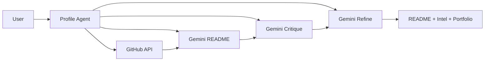

# GitSkins

GitSkins is a Gemini-powered **Profile Agent** that turns your GitHub activity into recruiter-ready READMEs, benchmarks, and portfolio case studies.

Built for the Google Gemini Hackathon 2026.

**Demo video (≤3 min):** [Link to be added]. Follow the script in `docs/submission.md` when recording.

## Table of Contents

- [Live Demo](#live-demo)
- [Key Features](#key-features)
- [Gemini Integration](#gemini-integration)
- [How the Profile Agent Works](#how-the-profile-agent-works)
- [Tech Stack](#tech-stack)
- [Usage](#usage)
- [Quick Start](#quick-start)
- [Local Development](#local-development)
- [Testing Instructions](#testing-instructions-demo-flow)
- [Known Limitations](#known-limitations)
- [Architecture](#architecture)
- [Credits](#credits)
- [License](#license)

## Live Demo

- Production: https://gitskins.com
- Demo path: landing → README Generator → AI Features → Showcase

## Key Features

- Dynamic GitHub profile widgets (cards, stats, languages, streaks)
- 20 curated themes with live previews
- AI README Generator with Career Mode and agent refinement
- Profile Intelligence (benchmarks, strengths, gaps, next actions)
- Portfolio Builder with AI-generated case studies
- AI profile analysis, theme recommendations, and chat assistant
- Shareable showcase pages and markdown snippets

## Gemini Integration

The Profile Agent uses the Gemini API across multiple features:

| Feature | Model | How It's Used |
|---------|--------|----------------|
| README Generator (Career Mode + refinement) | Gemini 2.5 Pro | Structured profile + role → full README; optional critique and refine |
| Profile Analysis | Gemini 2.5 Flash | GitHub data → persona, strengths, theme recommendation |
| Theme Recommendations | Gemini 2.5 Flash | Profile signals → ranked theme list with reasons |
| Profile Intelligence | Gemini 2.5 Flash | Activity data → benchmarks, gaps, next actions |
| Portfolio Case Studies | Gemini 2.5 Pro | Pinned repos → case studies (problem, approach, impact) |
| Chat Assistant | Gemini 2.5 Flash | User questions + context → guidance on themes and widgets |

Models are configurable via environment variables (see [Local Development](#local-development)).

## How the Profile Agent Works

1. **Enter GitHub username** — In the README Generator or AI page.
2. **Profile Agent fetches profile** — From the GitHub API (repos, languages, streaks, pinned repos).
3. **Gemini generates** — README (with optional critique/refine for Career Mode), or analysis, theme recommendations, profile intelligence, or portfolio case studies.
4. **Preview and copy** — View rendered markdown or results in the app; copy markdown or share showcase links.

The diagram below summarizes the README and AI flows: the Profile Agent orchestrates GitHub data and Gemini (README generation, optional critique, and refinement) to produce the final output.



See `docs/architecture.md` for more detail on the agent loop.

## Tech Stack

- Next.js (App Router)
- TypeScript
- Tailwind CSS + inline styles
- Google Gemini API
- GitHub GraphQL API

## Usage

1. **Open the landing page** — See widget previews and go to README Generator or AI Features.
2. **README Generator** — Enter your GitHub username, enable Career Mode (optional), and click "Generate README". Preview and copy the markdown.
3. **AI Features** — Go to `/ai`, enter a username, and run Profile Analysis, Theme Recommendations, Profile Intelligence, or Portfolio Builder.
4. **Portfolio and Showcase** — Visit `/portfolio/{username}` for case studies and `/showcase/{username}` to copy the markdown snippet.
5. **Copy or share** — Use the generated README in your repo or share your showcase link.

## Quick Start

```bash
git clone https://github.com/asamassekou10/GitSkins.git
cd gitskins
cp .env.example .env.local
# Edit .env.local and add GEMINI_API_KEY and GITHUB_TOKEN
npm install
npm run dev
```

Open http://localhost:3000

## Local Development

### Requirements

- Node.js 18+
- GitHub personal access token (for GraphQL)
- Gemini API key

### Environment Variables

Create a `.env.local`:

```
GITHUB_TOKEN=your_github_pat
GEMINI_API_KEY=your_gemini_api_key
GEMINI_MODEL=gemini-2.5-flash (optional, default)
GEMINI_MODEL_FAST=gemini-2.5-flash (optional)
GEMINI_MODEL_PRO=gemini-2.5-pro (optional)
```

Optional:

```
OPENAI_API_KEY=optional_fallback
```

### Run Locally

```
npm install
npm run dev
```

## Testing Instructions (Demo Flow)

1. Open `/` and verify widgets load for `octocat`.
2. Go to `/readme-generator`, enable Career Mode, and click "Generate README".
3. Go to `/ai` and run Profile Intelligence and Portfolio Builder.
4. Visit `/portfolio/octocat` to review case studies.
5. Visit `/showcase/octocat` and copy the markdown snippet.

For AI features, ensure `GEMINI_API_KEY` and `GITHUB_TOKEN` are set (e.g. in Vercel env vars or `.env.local`).

## Known Limitations

- **GitHub API rate limits** — Unauthenticated or high request volume may hit GitHub's rate limits; use a personal access token for higher limits.
- **No streaming** — README generation runs in one request; progress is simulated in the UI.
- **AI features require env vars** — `GEMINI_API_KEY` and `GITHUB_TOKEN` must be set in production (e.g. Vercel) or `.env.local` for AI features to work.
- **Gemini token/context limits** — Very long profiles or many pinned repos may be truncated to fit model context.

## Architecture

See `docs/architecture.md` for the Gemini data flow and agent loop overview.

## Credits

- [GitHub API](https://docs.github.com/en/rest) — Profile data, repos, languages, contributions
- [Google Gemini](https://ai.google.dev/) — README generation, profile analysis, theme recommendations, portfolio case studies, chat
- [Next.js](https://nextjs.org/) — Framework
- [Vercel](https://vercel.com/) — Hosting (optional)

## License

MIT
