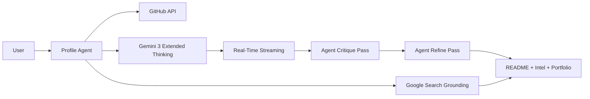

# GitSkins

GitSkins is a Gemini 3-powered **Profile Agent** that turns your GitHub activity into recruiter-ready READMEs, benchmarks, and portfolio case studies — with real-time streaming, extended thinking, and Google Search grounding.

Built for the **Gemini 3 Hackathon 2026**.

**Demo video (≤3 min):** [Link to be added]

## Table of Contents

- [Live Demo](#live-demo)
- [Key Features](#key-features)
- [Gemini 3 Integration](#gemini-3-integration)
- [How the Profile Agent Works](#how-the-profile-agent-works)
- [Tech Stack](#tech-stack)
- [Usage](#usage)
- [Quick Start](#quick-start)
- [Local Development](#local-development)
- [Testing Instructions](#testing-instructions-demo-flow)
- [Known Limitations](#known-limitations)
- [Architecture](#architecture)
- [Credits](#credits)
- [License](#license)

## Live Demo

- Production: https://gitskins.com
- Demo path: landing → Live README Agent → AI Features → Portfolio Builder

## Key Features

- **Live README Agent** — Watch Gemini 3 think, draft, critique, and refine your README in real-time via streaming
- Dynamic GitHub profile widgets (cards, stats, languages, streaks) with 20 curated themes
- AI README Generator with Career Mode and multi-pass agent refinement
- Profile Intelligence with Google Search grounding for real industry benchmarks
- Portfolio Website Builder with AI-generated case studies and natural language editing
- AI profile analysis, theme recommendations, and chat assistant

## Gemini 3 Integration

GitSkins uses the `@google/genai` SDK with deep Gemini 3 feature integration:

### Gemini 3 Features Used

| Feature | Where | Impact |
|---------|-------|--------|
| **Extended Thinking** (ThinkingLevel.HIGH) | README gen, portfolio, case studies, profile intel | Deeper reasoning = higher quality output |
| **Real-Time Streaming** (generateContentStream) | Live README Agent | Token-by-token generation with live thought surfacing |
| **Google Search Grounding** | Profile Intelligence | Industry benchmarks backed by real-world data |
| **Multi-Pass Agent Loop** (streamed) | Career Mode README | Generate → critique → refine, all streamed live |
| **Thought Surfacing** | Live README Agent | Model's reasoning process visible to users |

### Model Usage

| Feature | Model | Thinking Level |
|---------|-------|----------------|
| README Generator (Career Mode + refinement) | Gemini 3 Pro | HIGH |
| Live README Agent (streaming + agent loop) | Gemini 3 Pro | HIGH |
| Portfolio Website Generator | Gemini 3 Pro | HIGH |
| Portfolio Case Studies | Gemini 3 Pro | HIGH |
| Profile Intelligence (+ Search grounding) | Gemini 3 Pro | HIGH |
| Profile Analysis | Gemini 3 Flash | LOW |
| Theme Recommendations | Gemini 3 Flash | LOW |
| Chat Assistant | Gemini 3 Flash | LOW |

Models are configurable via environment variables (see [Local Development](#local-development)).

## How the Profile Agent Works

1. **Enter GitHub username** — In the Live README Agent, README Generator, or AI page.
2. **Profile Agent fetches profile** — From the GitHub API (repos, languages, streaks, pinned repos).
3. **Gemini 3 thinks and generates** — Extended Thinking reasons about the profile; tokens stream in real-time.
4. **Agent loop (Career Mode)** — Critique pass identifies improvements, refine pass applies them — all streamed.
5. **Preview, copy, or download** — View rendered markdown, copy to clipboard, or download portfolio as ZIP.



## Tech Stack

- Next.js 16 (App Router)
- TypeScript
- Tailwind CSS + Framer Motion
- `@google/genai` SDK (Gemini 3 Pro / Flash)
- GitHub GraphQL API

## Usage

1. **Live README Agent** (`/readme-agent`) — Enter username, watch Gemini 3 think and stream your README live. Enable Career Mode for the full agent loop.
2. **README Generator** (`/readme-generator`) — Traditional generation with Career Mode and agent refinement.
3. **AI Features** (`/ai`) — Profile Analysis, Theme Recommendations, Profile Intelligence (with Google Search grounding), Portfolio Builder.
4. **Portfolio Builder** (`/portfolio/{username}/build`) — Generate a full portfolio website with AI, edit with natural language, download as ZIP.
5. **Showcase** (`/showcase/{username}`) — Copy markdown widget snippets.

## Quick Start

```bash
git clone https://github.com/asamassekou10/GitSkins.git
cd gitskins
cp .env.example .env.local
# Edit .env.local and add GEMINI_API_KEY and GITHUB_TOKEN
npm install
npm run dev
```

Open http://localhost:3000

## Local Development

### Requirements

- Node.js 20+
- GitHub personal access token (for GraphQL)
- Gemini API key

### Environment Variables

Create a `.env.local`:

```
GITHUB_TOKEN=your_github_pat
GEMINI_API_KEY=your_gemini_api_key
GEMINI_MODEL=gemini-3-flash-preview (optional, default)
GEMINI_MODEL_FAST=gemini-3-flash-preview (optional)
GEMINI_MODEL_PRO=gemini-3-pro-preview (optional)
```

Optional:

```
OPENAI_API_KEY=optional_fallback
```

### Run Locally

```
npm install
npm run dev
```

## Testing Instructions (Demo Flow)

1. Open `/` and verify widgets load for `octocat`.
2. Go to `/readme-agent`, enter a username, and watch Gemini 3 think + stream.
3. Enable Career Mode and re-generate — verify the critique and refine passes stream live.
4. Go to `/readme-generator` and generate a README with Career Mode.
5. Go to `/ai` and run Profile Intelligence — verify grounded responses cite real data.
6. Visit `/portfolio/octocat/build` and generate a portfolio website.
7. Visit `/showcase/octocat` and copy the markdown snippet.

For AI features, ensure `GEMINI_API_KEY` and `GITHUB_TOKEN` are set.

## Known Limitations

- **GitHub API rate limits** — Use a personal access token for higher limits.
- **Gemini token/context limits** — Very long profiles may be truncated to fit model context.
- **AI features require env vars** — `GEMINI_API_KEY` and `GITHUB_TOKEN` must be set for AI features.

## Architecture

See `docs/architecture.md` for the Gemini data flow and agent loop overview.

## Credits

- [Google Gemini 3](https://ai.google.dev/) — Extended Thinking, Streaming, Google Search Grounding
- [`@google/genai` SDK](https://www.npmjs.com/package/@google/genai) — Gemini 3 integration
- [GitHub API](https://docs.github.com/en/rest) — Profile data
- [Next.js](https://nextjs.org/) — Framework
- [Framer Motion](https://motion.dev/) — Animations
- [Vercel](https://vercel.com/) — Hosting

## License

MIT
