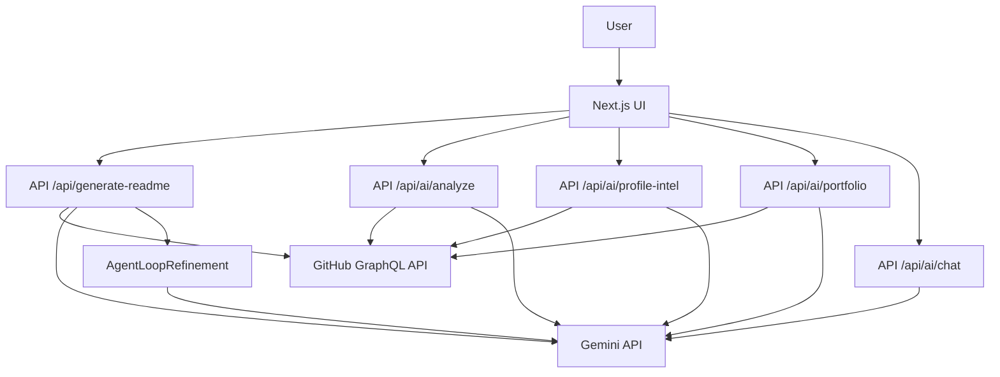

# Architecture Overview

GitSkins uses Next.js (App Router) with Gemini-powered API routes to generate README content, profile intelligence, and portfolio case studies.

## Agent Loop Refinement

1. Gemini generates a first-pass README.
2. Gemini critiques the README for role alignment.
3. Gemini refines the README using improvement notes.
